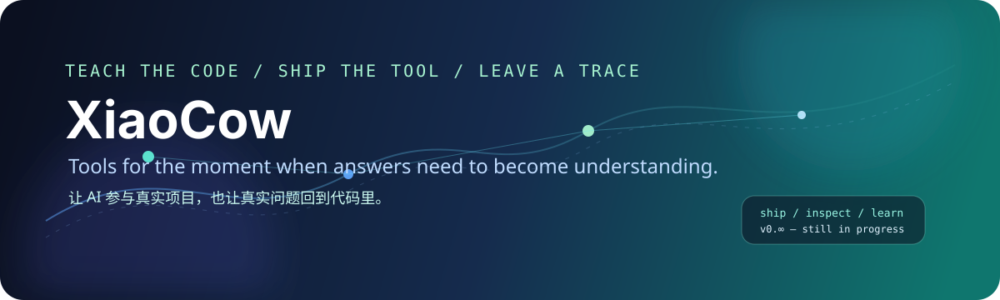

# XiaoCow / 小靠

<p align="center">
  
</p>

<p align="center">
  <a href="https://github.com/XiaoCow666/CodeSense"></a>
  <a href="https://github.com/XiaoCow666/Caifusi"></a>
  <a href="https://saucodesense.com"></a>
</p>

## Hello, I'm XiaoCow

我是一名计算机专业学生，也是一名还在持续试错的 AI-native builder。我的兴趣点不只在模型本身，而在模型真正进入项目之后会发生什么：它能不能调用工具，能不能留下证据，能不能让学生学会，而不是替学生交作业。

I build AI-assisted products for learning, work, and the messy middle in between. My current threads are LLM applications, agents, MCP, programming education, financial literacy, and privacy-aware machine learning.

我喜欢把一个想法推到可以运行的位置，再回头处理架构、权限、日志、体验和团队协作。代码只是其中一段，能让别人接手、复现、继续改，才算真的做完。

## What I'm building

### CodeSense 酷森思

**An AI-assisted programming education platform for universities.**

CodeSense started with a simple frustration: an Online Judge can tell a student that the answer is wrong, but it usually cannot explain where the understanding broke. The platform connects code evaluation, restricted execution, guided learning, and teacher-facing learning analytics in one workflow.

学生不会直接跳到“让 AI 给答案”。一份练习会经过三步：先描述思路，再组装程序步骤，最后用自己的话向 AI 解释代码。系统把提交结果、编译运行证据和学习过程放在一起，教师可以从班级、作业和知识点三个视角查看进展。

| 方向 | 当前实现 |
| --- | --- |
| 评测 | C++17 编译、测试用例、编译错误、运行时错误、超时和输出规范化 |
| 受限执行 | 临时工作目录、超时控制、输出长度限制和执行后清理 |
| 引导学习 | 思路描述 → 步骤组装 → 费曼式解释 |
| 教师视图 | 作业、班级、花名册、提交记录和知识点趋势 |
| 技术栈 | Python、Flask、SQLAlchemy、SQLite/MySQL、Redis/文件会话、Monaco Editor、Chart.js |

<p align="center">
  
  
  
</p>

→ [Repository](https://github.com/XiaoCow666/CodeSense) · [Live demo](https://saucodesense.com) · [中文文档](https://github.com/XiaoCow666/CodeSense/blob/main/README.md) · [English docs](https://github.com/XiaoCow666/CodeSense/blob/main/README.en.md)

### Caifusi 财赋思

**An AI-powered financial mindset coach for university students.**

Caifusi is about the part of financial education that rarely fits into a spreadsheet: why a person makes a choice, what they are worried about, and what small action they can take next. I am exploring conversational learning, knowledge bases, risk reminders, and action planning for campus scenarios.

<p align="center">
  
</p>

→ [Repository](https://github.com/XiaoCow666/Caifusi)

### Fair-Fed-CI

**A research prototype for privacy-preserving and subpopulation-fair student performance prediction.**

This line of work looks at federated learning, personalized constraints, feature and self-attention, and SHAP-based explanations. The goal is to make model outputs more useful without pretending that a single score can describe a student. The research notes, parameters, and results are kept separate from confirmed experiments until they are reproducible.

→ [Repository](https://github.com/XiaoCow666/Fair-Fed-CI)

## A short version of my story

I got interested in AI-assisted development through Cursor near the end of 2024. At first, the obvious question was “how fast can this help me write code?” The more interesting question arrived later: “what should the system refuse to do, and what should it teach instead?”

That question pulled me toward CodeSense. It also changed how I work on projects. I now care about the whole loop: clarify the need, write down the acceptance criteria, build a small path that can run, inspect the evidence, and leave a clean handoff for the next person.

Outside the repositories, I help organize and support AI-related campus activities, including AI+X sessions and OpenClaw/QClaw workshops in Shenyang. A good event is not just a talk. Someone has to make the setup work, answer the strange error at the back of the room, collect the failure cases, and turn them into the next version of the tutorial.

## My working notes

```text
idea
  ↓
requirements + evidence
  ↓
PRD → technical plan → implementation
  ↓
test → deploy → review
  ↓
document what changed, what failed, and what should happen next
```

I use AI as a collaborator with tools, boundaries, and a paper trail. LLMs, agents, MCP servers, OpenClaw, Cursor, and Feishu workflows are useful when they shorten the distance between a question and a verifiable result. They are less useful when they produce confident text that nobody can run.

## Things I care about

- AI that helps people understand a problem instead of hiding the reasoning.
- Learning systems that record process, not only the final score.
- Privacy and fairness when models touch student data.
- Small, readable interfaces that make the next action obvious.
- Projects with enough documentation for a new contributor to get started.
- Communities where people bring a broken demo and leave with a better one.

## Tools I reach for

<p>
  
  
  
  
  
  
  
  
  
</p>

## Current focus

- Making CodeSense easier to deploy, understand, and extend.
- Turning project conversations into PRs, issues, release notes, and reusable docs.
- Exploring multi-agent workflows with real tool calls and observable execution.
- Continuing research around federated learning, fairness, and explainability.
- Building practical AI learning experiences for students and campus communities.

## GitHub at a glance

<p align="center">
  
  
</p>

## Find me here

- Code and experiments: [github.com/XiaoCow666](https://github.com/XiaoCow666)
- CodeSense: [github.com/XiaoCow666/CodeSense](https://github.com/XiaoCow666/CodeSense)
- Caifusi: [github.com/XiaoCow666/Caifusi](https://github.com/XiaoCow666/Caifusi)
- Fair-Fed-CI: [github.com/XiaoCow666/Fair-Fed-CI](https://github.com/XiaoCow666/Fair-Fed-CI)
- CodeSense demo: [saucodesense.com](https://saucodesense.com)

如果你对 AI 教学工具、Agent 工程、MCP、校园技术社区，或者“怎样让一个项目真的能被别人用起来”感兴趣，欢迎来聊。带着问题来更好，带着一个能运行的 demo 来也行。

<p align="center">
  <i>Still learning. Still shipping. Still leaving notes for future me.</i>
</p>
