# 小靠 / XiaoCow

<p align="center">
  
</p>

<p align="center">
  <a href="https://github.com/XiaoCow666/CodeSense"></a>
  <a href="https://github.com/XiaoCow666/Caifusi"></a>
  <a href="https://saucodesense.com"></a>
</p>

> 我在做一件有点固执的事：让 AI 不要急着把答案递给人，而是先把人带到答案附近。
>
> I build tools for the moment when “I have the answer” is not the same as “I understand it.”

## 先说我在做什么

我是一名计算机专业学生，主要做 AI 应用、编程教育工具和 Agent 工作流。最近的项目都围绕同一个问题展开：当 AI 参与学习和工作时，怎样让它真的帮上忙，同时保留过程、边界和可以复查的证据。

I am a computer science student building AI-assisted products for learning and work. I care about the part after the demo: tool calls, permissions, failure cases, handoffs, and whether another person can actually run what I built.

## 一条不太短的时间线

```text
late 2024  Cursor
           “AI 能不能让我更快写出东西？”

2025       CodeSense
           “如果 AI 直接给答案，学生还剩下什么？”

2026       Agents / MCP / OpenClaw / Feishu workflows
           “工具真的执行过了吗？过程能不能留下来？”
```

我没有把这些问题想成一套漂亮的方法论。很多时候，它们是在一次次部署失败、答辩追问、学生反馈和活动现场的“怎么又报错了”里长出来的。现在我更相信可运行的证据，也更愿意把失败记录下来。

## 主线项目：CodeSense 酷森思

### 让代码评测离“对 / 错”再近一点学习

<p align="center">
  <a href="https://github.com/XiaoCow666/CodeSense">
    <picture>
      <source media="(prefers-color-scheme: dark)" srcset="./assets/codesense/logo-dark.png" />
      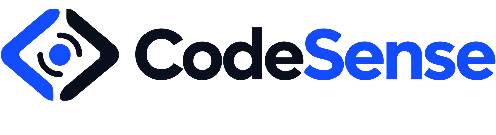
    </picture>
  </a>
</p>

[CodeSense](https://github.com/XiaoCow666/CodeSense) 是一个面向高校编程教学的代码评测与学习平台。

普通 OJ 很擅长告诉学生程序通过了没有。问题是，学生看到 WA 之后，往往仍然不知道自己错在算法、实现、边界条件，还是根本没有理解题目。CodeSense 把代码提交、受限执行、AI 辅导、分阶段练习和教师学情视图放进同一条流程里。

一次练习会经过三站：

1. 学生先用自然语言描述思路。
2. 再逐步组装程序步骤并提交代码。
3. 最后尝试用自己的话解释程序，接受追问，再回去修改。

系统记录的不只是最后得了几分，也包括编译错误、运行结果、提示请求和学习过程。教师可以查看作业、班级、提交记录和知识点趋势。AI 仍然会犯错，所以最终判断回到程序评测和教师反馈。

<p align="center">
  
  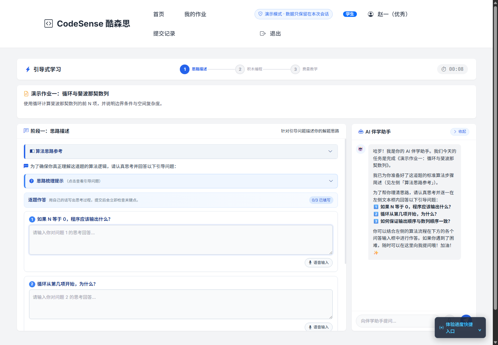
  
</p>

```text
学生：描述思路 → 组装步骤 → 解释代码 → 再提交
教师：布置作业 → 查看提交 → 观察知识点 → 找到共性问题
系统：编译运行 → 保存证据 → 给出提示 → 把人送回思考现场
```

→ [GitHub](https://github.com/XiaoCow666/CodeSense) · [在线体验](https://saucodesense.com) · [中文 README](https://github.com/XiaoCow666/CodeSense/blob/main/README.md) · [English README](https://github.com/XiaoCow666/CodeSense/blob/main/README.en.md)

## 另外两条线

### Caifusi 财赋思

[Caifusi](https://github.com/XiaoCow666/Caifusi) 是一个面向大学生的 AI 财商教练。

我对它感兴趣，是因为财商教育经常被讲成表格和结论，但真实的选择往往夹着犹豫、冲动和“我知道这样不太好，可是……”这类时刻。项目正在探索对话式学习、知识库、风险提醒和行动计划，让建议更接近一个人下一步真的能做的事。

<p align="center">
  <a href="https://github.com/XiaoCow666/Caifusi">
    <picture>
      <source media="(prefers-color-scheme: dark)" srcset="./assets/caifusi/logo-dark.png" />
      
    </picture>
  </a>
</p>

<p align="center">
  <a href="https://github.com/XiaoCow666/Caifusi">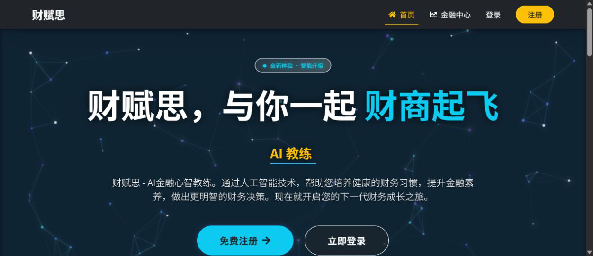</a>
  <a href="https://github.com/XiaoCow666/Caifusi">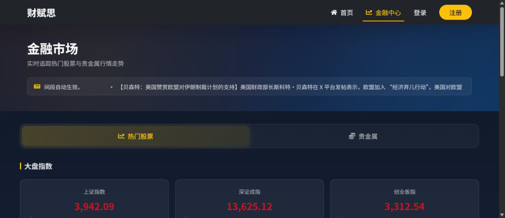</a>
  <a href="https://github.com/XiaoCow666/Caifusi">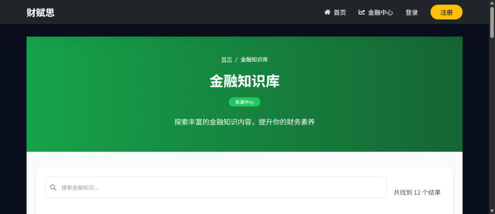</a>
</p>

### Fair-Fed-CI

[Fair-Fed-CI](https://github.com/XiaoCow666/Fair-Fed-CI) 是一条关于联邦学习、公平性和可解释性的研究实践线。

它尝试讨论一个不太舒服的问题：如果模型要预测学生表现，怎样让不同学院的模型表现不要只看平均分，同时还让人知道模型为什么这样判断。当前仓库是单机顺序模拟，不是已经部署的跨机构生产系统；结果也严格区分验证集和正式留出测试集。

最近一次正式结果汇总是 `2 个数据集 × 7 种方法 × 5 个随机种子 = 70 个运行组合`。它给我的结论不是“某个方法赢麻了”，而是平均性能和最差客户端表现经常由不同方法拿到：

- 在 OULAD 上，Ditto 的 pooled RMSE 为 `0.1146 ± 0.0013`；FedPer 的 worst-client RMSE 为 `0.2042 ± 0.0046`，而 FedAvg 基线分别为 `0.1478 ± 0.0026` 和 `0.2918 ± 0.0046`。
- 在 Private 数据集上，APFL 的 pooled RMSE 最低，为 `0.0919 ± 0.0018`；FedProx 的 worst-client RMSE 最低，为 `0.3900 ± 0.0281`，但与 FedAvg 的 `0.3914 ± 0.0275` 差距很小。
- 所以现在更准确的说法是：个性化方法在异质数据上很有价值，但“总体更准”和“最差学校不掉队”不是同一个目标，也还没有一个方法在所有指标上统治全场。

<p align="center">
  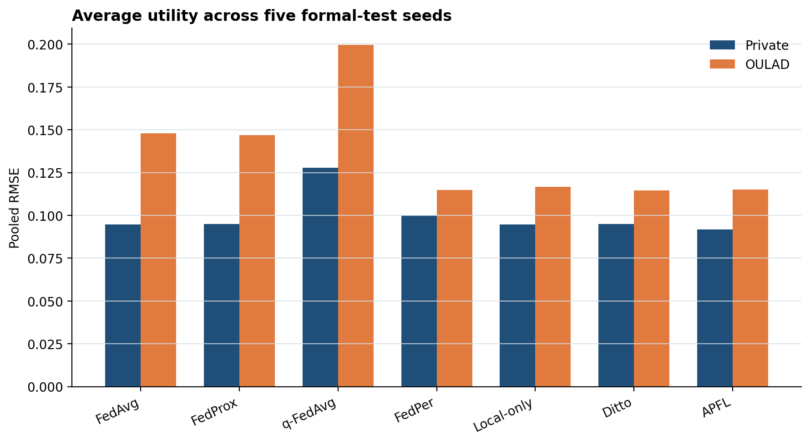
  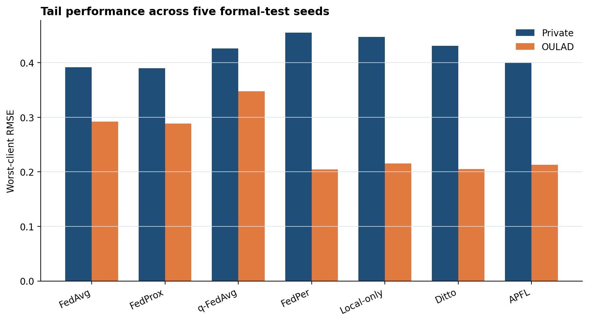
</p>

<p align="center">
  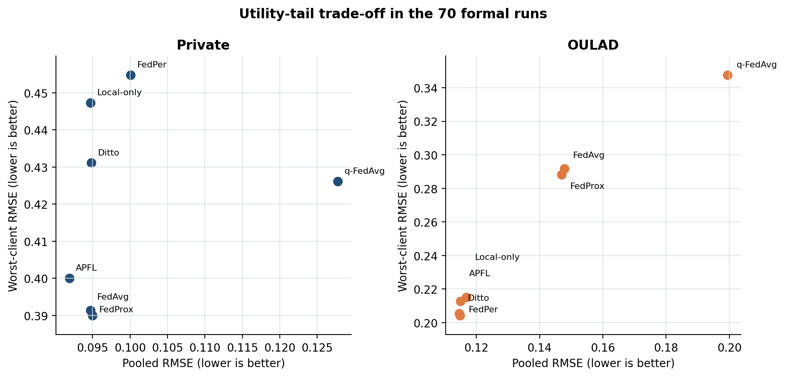
</p>

研究流程也已经从单一模型实验扩展到：学业轨迹时间切分 → EnhancedNet 特征建模 → 客户端本地训练 → 学院级聚合 → 客户端本地诊断输出。

<p align="center">
  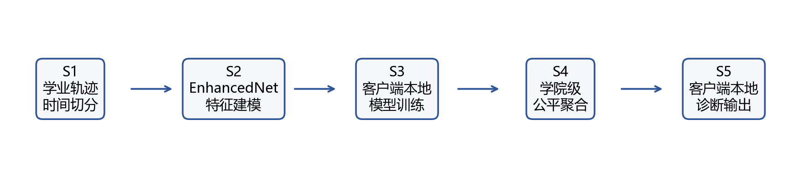
</p>

## 我在项目里通常会做的事

- 把聊天里的模糊想法整理成 PRD、技术方案和验收条件。
- 让 AI 参与代码工作，但把工具调用、权限、日志和回滚点留清楚。
- 把一次活动里遇到的故障，变成下一版教程里的检查项。
- 让新成员先写一份项目理解 PR，再开始改代码。
- 把“已经实现”“外部服务”“准备以后做”分开写。

项目协作大致长这样：

```text
问题 → 需求 → 可运行的小路径 → 测试与证据 → PR → 部署 → 复盘
```

这条链听上去不酷，但它能在项目交接、比赛答辩和现场救火时少制造一点惊喜。

## 在代码之外

我也参与沈阳和沈航相关的 AI 校园活动、AI+X 高校行以及 OpenClaw/QClaw 活动的组织和助教工作。现场最有价值的时刻通常不是讲师顺利讲完，而是有人卡在安装、网络或配置上，大家一起把问题拆开，最后让 demo 跑起来。

我还保留了不少 CodeSense 的 bug 截图和问题记录。它们看起来有点狼狈，却比“体验很好，后续优化”更能帮助下一次设计。

## 我愿意聊什么

AI 教学工具、Agent 工程、MCP、代码评测、联邦学习、公平与可解释机器学习、校园技术社区，以及如何把一个想法从聊天窗口拖进真正能运行的项目里。

如果你也在做类似的东西，欢迎直接发仓库或失败日志。一个能运行但不完美的 demo，通常比一份宏大规划更适合开始聊天。

## 技术工具箱

<p>
  
  
  
  
  
  
  
  
</p>

## GitHub 入口

<p align="center">
  <a href="https://github.com/XiaoCow666/CodeSense">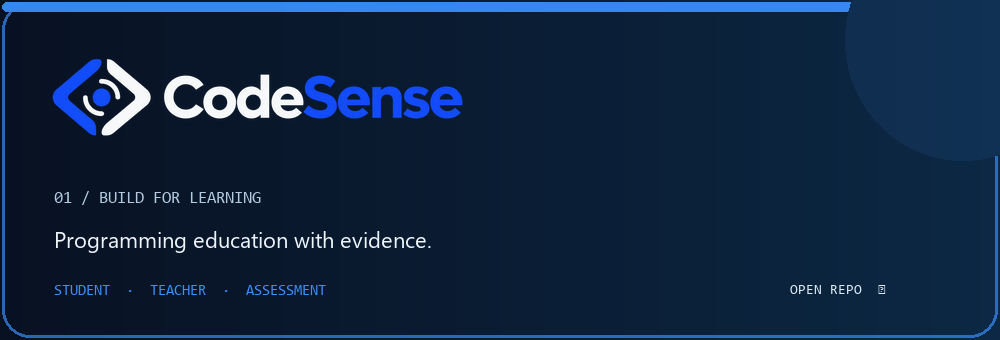</a>
  <a href="https://github.com/XiaoCow666/Caifusi">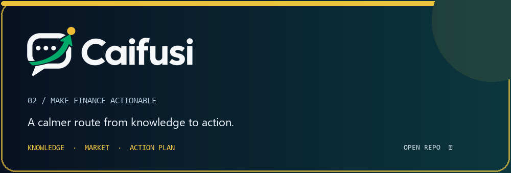</a>
</p>

<p align="center">
  <a href="https://github.com/XiaoCow666/CodeSense">CodeSense</a> ·
  <a href="https://github.com/XiaoCow666/Caifusi">Caifusi</a> ·
  <a href="https://github.com/XiaoCow666/Fair-Fed-CI">Fair-Fed-CI</a>
</p>

<p align="center">
  <a href="https://github.com/XiaoCow666"></a>
  <a href="https://github.com/XiaoCow666?tab=repositories"></a>
</p>

<p align="center">
  <i>Still learning. Still shipping. Still keeping the weird bug screenshots.</i>
</p>
